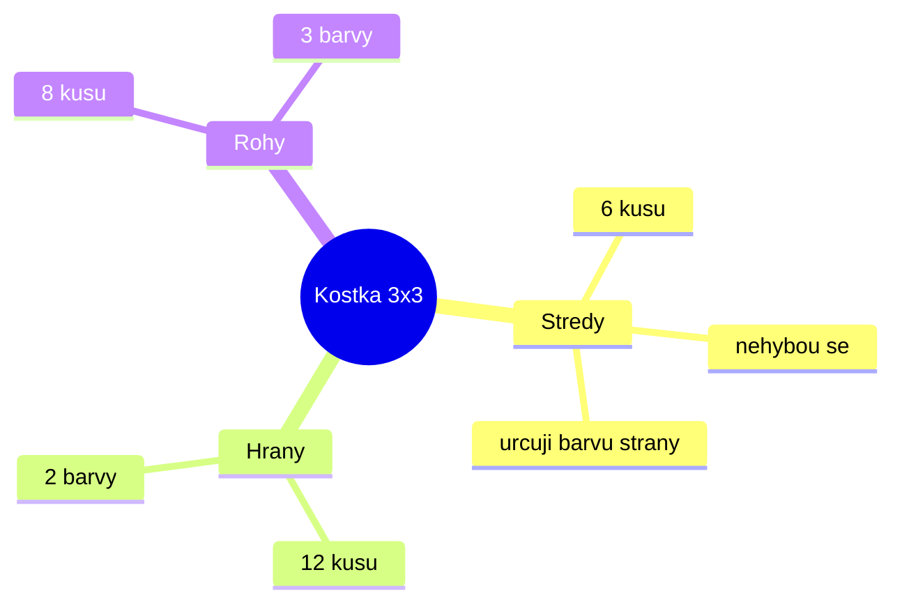

# K01: Co je Rubikova kostka: středy, hrany a rohy

### Cíle
Po prostudování umíš: pojmenovat tři druhy dílků kostky, vysvětlit, proč se středy nikdy nehýbou, poznat, kam který dílek patří, a říct, co vlastně znamená "složená kostka".

### Klíčové koncepty

**Kostka není 54 nálepek, ale 26 dílků.** Když kostku otočíš, nehýbou se barvičky, ale celé kostičky. To je nejdůležitější objev celého kurzu. Kdo přemýšlí v nálepkách, ten se ztratí. Kdo přemýšlí v dílcích, ten kostku složí.

**Středy (centers) jsou kapitáni.** Uprostřed každé strany je jeden střed. Středů je 6 a nikdy se nehýbou z místa, jen se otáčí kolem osy. Střed říká: "Tahle strana bude moje barva!" Bílý střed = tady bude bílá strana. Proto bílá strana není "kde je nejvíc bílé", ale "kde je bílý střed".

**Hrany (edges) mají 2 barvy.** Je jich 12 a sedí mezi dvěma středy. Hrana bílá a červená patří přesně mezi bílý a červený střed. Nikam jinam. Každý dílek má jen jedno správné místo, jako dílek puzzle.

**Rohy (corners) mají 3 barvy.** Je jich 8, sedí v rozích. Roh bílá, červená, modrá patří tam, kde se potkávají bílý, červený a modrý střed.

**Složená kostka = každý dílek doma.** Neskládáme barvy, stěhujeme dílky na jejich domácí adresy. Pro dospělé: kostka je systém s pevným indexem (středy) a 20 pohyblivými záznamy, skládání je řazení podle klíče, ne malování.

### Aplikace do 30 dnů
Vezmi kostku do ruky. Najdi všech 6 středů a řekni nahlas jejich barvy. Pak najdi hranu bílá a červená a ukaž, mezi které dva středy patří. Nakonec najdi roh se třemi barvami a jeho domov. Zvládne to s tebou i dítě: hrajte na "detektivy dílků", kdo dřív najde domeček dílku, má bod.

### Kontrolní otázky
1. Kolik má kostka středů, hran a rohů? 2. Proč se středy nikdy nepohnou jinam? 3. Kam patří hrana se žlutou a zelenou barvou? 4. Proč je lepší myslet na dílky, a ne na nálepky? 5. Co přesně znamená, že je kostka složená?

### Zdroje
Kniha: Ian Scheffler: Cracking the Cube. Online: ruwix.com (základy kostky), jperm.net.
