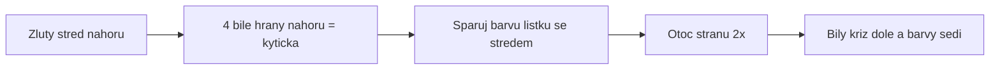

# K03: Bílá kytička a bílý kříž

### Cíle
Po prostudování umíš: složit bílou kytičku kolem žlutého středu, proměnit kytičku v bílý kříž se správnými barvami a zkontrolovat si, že je kříž opravdu dobře.

### Klíčové koncepty

**První cíl je kytička, ne kříž.** Otoč kostku žlutým středem nahoru. Úkol: dostat 4 bílé hrany nahoru kolem žlutého středu, aby vypadaly jako bílé okvětní lístky kytičky se žlutým středem. Na pořadí barev zatím nezáleží, jen bílá nahoru.

**Jak dostat lístek nahoru.** Najdi hranu s bílou barvou. Když je dole, otoč spodní stranou tak, aby byla pod prázdným místem kytičky, a otoč tou boční stranou dvakrát. Když je v prostřední vrstvě, otoč boční stranou tak, aby vyjela nahoru. Když už je nahoře, ale bílou do strany, schovej ji dolů a zkus to znovu. Žádné vzorečky, jen koukej a zkoušej. Tohle je hraní, ne matematika.

**Z kytičky kříž: spáruj a pošli dolů.** Teď vezmi jeden lístek a otáčej horní stranou (U), dokud druhá barva lístku nesedí na středu stejné barvy pod ním. Zelená hrana nad zelený střed. Pak tu stranu otoč dvakrát (F2) a lístek sjede dolů. Zopakuj pro všechny 4 lístky. Vznikne bílý kříž dole.

**Kontrola je povinná.** Otoč kostku bílým křížem k sobě: kolem bílého středu je kříž a každá hrana kříže navazuje barvou na svůj střed. Když barvy nesedí, hrana je na špatném místě a druhá vrstva pak nepůjde. Pro dospělé: tohle je unit test prvního kroku, bez zeleného testu se nepokračuje.

### Aplikace do 30 dnů
Slož kytičku 5x za sebou a měř si to. Pak 5x celý kříž. S dítětem: ty děláš kytičku, dítě hledá, který lístek patří ke kterému středu. Cíl na konec týdne: kříž do 2 minut bez nápovědy.

### Kontrolní otázky
1. Proč začínáme kytičkou nahoře, a ne rovnou křížem dole? 2. Kde musí být žlutý střed, když skládáš kytičku? 3. Jak pošleš lístek z kytičky dolů na správné místo? 4. Jak poznáš, že je kříž správně, a ne jen bílý? 5. Co se pokazí později, když kříž nemá správné barvy?

### Zdroje
Kniha: Ian Scheffler: Cracking the Cube. Online: jperm.net (beginner tutorial), ruwix.com.
