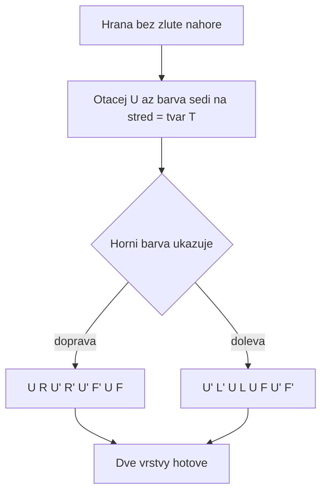

# K05: Druhá vrstva: hrany doprostřed

### Cíle
Po prostudování umíš: otočit kostku bílou dolů a pracovat se žlutou nahoře, najít hranu bez žluté barvy, udělat z ní tvar T a poslat ji doprava nebo doleva do prostřední vrstvy.

### Klíčové koncepty

**Otoč svět vzhůru nohama.** Hotová bílá vrstva jde dolů a už na ni nesaháme, jen jí věříme. Nahoře je teď žlutá strana, tam se všechno děje. Od teď platí: pracujeme shora, hotové věci jsou dole.

**Hledej hranu bez žluté.** V horní vrstvě najdi hranu, která nemá žádnou žlutou barvu. Ta patří do prostřední vrstvy. Hrany se žlutou nech být, ty přijdou na řadu v dalším bloku.

**Udělej téčko.** Otáčej horní stranou (U), dokud přední barva hrany nesedí na střed pod ní. Vznikne obrácené T: sloupek je střed, stříška je hrana. Teď se podívej na horní barvu hrany: ukazuje, jestli hrana chce doprava, nebo doleva.

**Doprava: U R U' R' U' F' U F.** Osm tahů, které hranu zavezou do pravého slotu. Říkej si: nahoru, pravá, zpátky, zpátky, zpátky, přední čárka, nahoru, přední. **Doleva: U' L' U L U F U' F'.** Zrcadlově totéž doleva. Nemusíš rozumět proč, stačí přesně číst. Porozumění přijde v bloku 3 u F2L.

**Špatně usazená hrana?** Když je hrana v prostřední vrstvě, ale otočená nebo cizí, vlož na její místo libovolnou horní hranu (tím ji vyhodíš nahoru) a pak ji usaď správně. Pro dospělé: klasický swap přes dočasnou proměnnou.

### Aplikace do 30 dnů
Slož dvě vrstvy 5x za sebou. Nejdřív s tahákem, pak zkus pravý algoritmus zpaměti. S dítětem: dítě hledá hrany bez žluté a říká "doprava" nebo "doleva", ty točíš. Cíl: dvě vrstvy do 5 minut.

### Kontrolní otázky
1. Proč se kostka po první vrstvě otáčí bílou dolů? 2. Jak poznáš hranu, která patří do prostřední vrstvy? 3. Co je tvar T a k čemu slouží? 4. Podle čeho se rozhodneš mezi pravým a levým algoritmem? 5. Jak opravíš hranu, která je v prostřední vrstvě špatně?

### Zdroje
Kniha: Ian Scheffler: Cracking the Cube. Online: jperm.net (beginner tutorial), ruwix.com.
