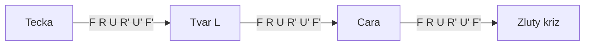

# K06: Žlutý kříž

### Cíle
Po prostudování umíš: poznat čtyři možné tvary žluté na horní straně (tečka, L, čára, kříž), správně kostku natočit a pomocí F R U R' U' F' dojít vždy až ke žlutému kříži.

### Klíčové koncepty

**Poslední vrstva se skládá ve čtyřech krocích.** Žlutý kříž, žluté hrany na správná místa, žluté rohy na správná místa, otočení rohů. Blok 2 je projde jeden po druhém. Dnes první krok: nahoře žlutý kříž, na barvy po stranách zatím nekoukáme.

**Podívej se, jaký tvar žlutá dělá.** Počítají se jen hrany, rohy ignoruj. Uvidíš jednu ze čtyř možností: samotnou tečku (jen střed), písmeno L ze dvou hran, vodorovnou čáru ze tří žlutých v řadě, nebo rovnou kříž.

**Jedno kouzlo stačí: F R U R' U' F'.** Šest tahů. Z tečky udělá L, z L udělá čáru, z čáry udělá kříž. Nejhorší případ znamená kouzlo třikrát za sebou. Pro děti: je to jako zalévání kytky, po každém zalití vyroste o kousek.

**Natočení rozhoduje.** Před kouzlem kostku natoč: L musí být v levém horním rohu (jako začátek písmene L při psaní), čára musí ležet vodorovně, zleva doprava. Špatné natočení = kouzlo vyjde naprázdno a jen si prodloužíš cestu.

**Pro dospělé:** je to první čistý algoritmus s podmínkou na vstupu. Stejný kód, tři různé vstupní stavy, deterministický výstup. Rozpoznání stavu (recognition) je půlka výkonu, to platí až po speedcubing.

### Aplikace do 30 dnů
Zamíchej kostku, slož dvě vrstvy a udělej žlutý kříž. Opakuj 5x. Před každým kouzlem nahlas řekni, jaký tvar vidíš a jak má být natočený. S dítětem: dítě hlásí tvar (tečka, L, čára), ty točíš.

### Kontrolní otázky
1. Jaké čtyři tvary může žlutá nahoře dělat? 2. Jak natočíš L a jak čáru před algoritmem? 3. Kolikrát nejvýš musíš kouzlo zopakovat od tečky ke kříži? 4. Proč u žlutého kříže zatím neřešíme barvy po stranách? 5. Předveď F R U R' U' F' zpaměti.

### Zdroje
Kniha: Ian Scheffler: Cracking the Cube. Online: jperm.net (beginner tutorial), ruwix.com.
