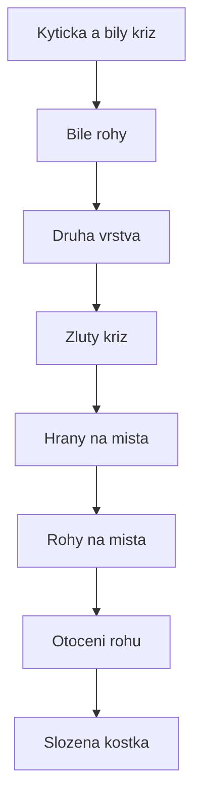

# K08: Otočení rohů: kostka složena!

### Cíle
Po prostudování umíš: otočit poslední rohy pomocí známého výtahu R' D' R D, nezpanikařit, když se kostka uprostřed kroku tváří rozbitě, a dokončit celou kostku od zamíchání až do konce bez cizí pomoci.

### Klíčové koncepty

**Poslední krok používá starého známého.** Výtah R' D' R D z K04 umí i poslední krok. Drž kostku žlutou nahoru a vyber roh, který není žlutou nahoru, natoč ho do pravého předního horního rohu.

**Točíme roh, ne kostku.** Opakuj R' D' R D (dvakrát nebo čtyřikrát), dokud roh nemá žlutou nahoře. Pak NEOTÁČEJ kostku v ruce, jen otoč horní stranou (U), aby na pravé přední místo přijel další neotočený roh. A znovu.

**Kostka bude vypadat rozbitě. To je správně.** Uprostřed tohohle kroku spodní vrstvy vypadají zničené. Neopravuj je! Poslední otočení posledního rohu všechno srovná najednou. Pro děti: je to jako úklid pokoje, chvíli je větší nepořádek než na začátku, ale na konci je uklizeno. Pro dospělé: transakce commitne až na konci, mezistav nečti.

**Hotovo. Co teď?** Dotoč horní vrstvu a máš složenou kostku. Umíš něco, co umí málokdo. Od teď je každé složení jen trénink: stejné kroky, míň přemýšlení, víc plynulosti.

**Celá cesta na jedné kartě:** kytička, bílý kříž, bílé rohy (výtah), druhá vrstva (doprava/doleva), žlutý kříž (F R U R' U' F'), hrany (Sune), rohy na místa (kolotoč), otočení rohů (výtah). Osm kroků, čtyři kouzla.

### Aplikace do 30 dnů
Slož kostku 10x celou od zamíchání. Prvních 5x s tahákem, dalších 5x bez něj. Zapiš si čas prvního a desátého složení, uvidíš pokrok černé na bílém. Nauč celý postup jednoho člověka z rodiny.

### Kontrolní otázky
1. Který algoritmus otáčí poslední rohy a odkud ho znáš? 2. Proč se mezi rohy otáčí jen horní strana, a ne celá kostka? 3. Proč vypadá kostka uprostřed kroku rozbitě a proč se nesmí opravovat? 4. Vyjmenuj všech osm kroků složení. 5. Slož kostku a nahlas komentuj, co děláš.

### Zdroje
Kniha: Ian Scheffler: Cracking the Cube. Online: jperm.net (beginner tutorial), ruwix.com.
