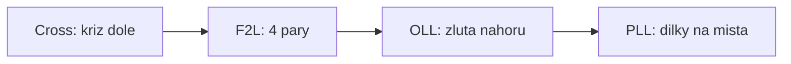

# K11: CFOP přehled a plánování kříže

### Cíle
Po prostudování umíš: popsat čtyři fáze metody CFOP a čím se liší od metody vrstev, složit kříž rovnou dole bez kytičky, naplánovat celý kříž během 15 sekund inspekce a vysvětlit, proč se kříž skládá na 8 tahů i míň.

### Klíčové koncepty

**CFOP = Cross, F2L, OLL, PLL.** Nejrozšířenější speedcubingová metoda (jede na ní většina špičky). Kříž dole (Cross), první dvě vrstvy po párech (F2L), orientace poslední vrstvy (OLL), permutace poslední vrstvy (PLL). Není to nová kostka, je to refaktoring: stejný výsledek, míň kroků, víc přemýšlení předem.

**Kytička byla lešení. Zbourej ji.** Kytička je skvělá na učení, ale stojí tahy navíc. Od teď skládej kříž rovnou bílou dolů: najdi bílou hranu, srovnej ji s barvou středu a zavez dolů nejkratší cestou. Prvních pár dní to bude pomalejší. To je normální cena refaktoringu.

**Inspekce: 15 sekund plánování zdarma.** Na soutěži (i v tréninku podle pravidel WCA) máš před startem 15 sekund na prohlédnutí kostky. Cíl této úrovně: najít všechny čtyři bílé hrany a naplánovat celý kříž dopředu, pak ho odtočit se zavřenýma očima klidně pomalu. Plán poráží reakci.

**Kříž je vždy do 8 tahů.** Matematicky dokázané: každý kříž jde složit na 8 tahů nebo míň, průměr je kolem 5 až 6. Nehledej dokonalost, hledej plán bez zbytečných oprav. Dobrý kříž taky nechává kostku v dobré pozici pro první pár F2L.

**Pro tvůj profil:** plánování v inspekci je čistá analytická práce, to ti sedne. Pozor na opačnou past: nepiluj kříž do dokonalosti donekonečna, když bottleneck bude brzy jinde. Profiluj a jdi dál.

### Aplikace do 30 dnů
Týden skládej kříž rovnou dole, bez kytičky. Pak trénuj inspekci: 15 sekund koukej, naplánuj kříž nahlas, odtoč. Nejdřív s otevřenýma, pak se zavřenýma očima. Cíl: 5 křížů z 10 odtočených přesně podle plánu.

### Kontrolní otázky
1. Co znamenají čtyři písmena CFOP? 2. Proč se v CFOP vynechává kytička? 3. K čemu slouží 15 sekund inspekce a co přesně v ní plánuješ? 4. Na kolik tahů jde vždy složit kříž? 5. Čím se pozná dobrý kříž kromě počtu tahů?

### Zdroje
Kniha: Dan Harris: Speedsolving the Cube. Online: jperm.net (CFOP), cubeskills.com (Feliks Zemdegs).
